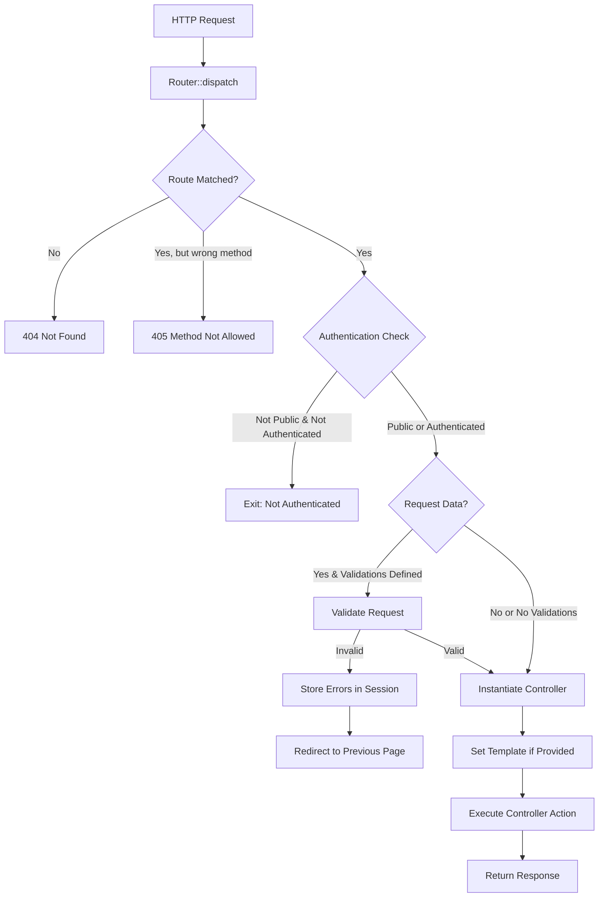
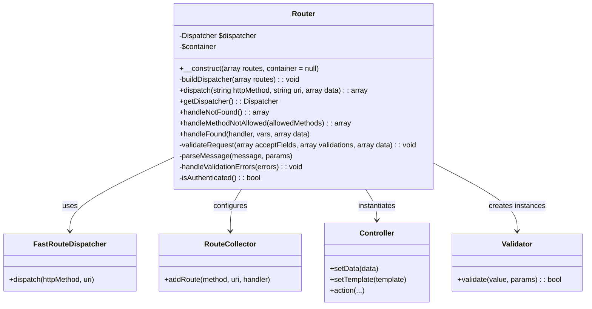
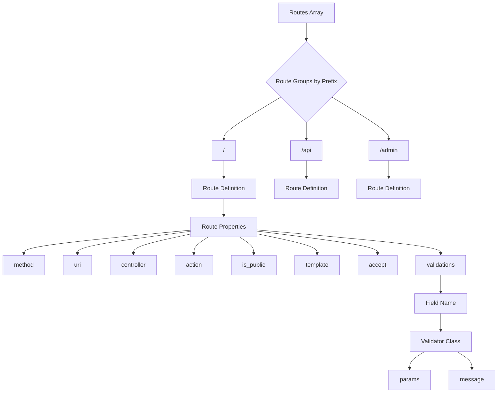

# Nexus Application Router

This document provides a comprehensive overview of the Nexus Application Router system, a PHP routing library built on top of FastRoute.

## Table of Contents

- [Overview](#overview)
- [Installation](#installation)
- [Usage](#usage)
    - [Basic Configuration](#basic-configuration)
    - [Route Definition](#route-definition)
    - [Handling Requests](#handling-requests)
- [Features](#features)
    - [Authentication Control](#authentication-control)
    - [Request Validation](#request-validation)
    - [Template Support](#template-support)
- [Architecture](#architecture)
- [API Reference](#api-reference)
- [Examples](#examples)
- [Flow Diagrams](#flow-diagrams)
    - [Request Processing Flow](#request-processing-flow)
    - [Class Diagram](#class-diagram)
    - [Route Structure](#route-structure)
- [Source Code](#source-code)

## Overview

The Nexus Application Router is a flexible, feature-rich routing system designed for PHP applications. It provides:

- URL to controller mapping
- HTTP method routing
- Authentication checks
- Request validation
- Response handling
- Template integration

The router leverages FastRoute for efficient route matching and provides additional application-level features like authentication, validation, and template management.

## Installation

```bash
composer require nexus/application
```

## Usage

### Basic Configuration

```php
<?php
use Nexus\Application\Router;

// Define routes
$routes = [
    '/' => [
        [
            'method' => 'GET',
            'uri' => '',
            'controller' => 'App\Controllers\HomeController',
            'action' => 'index',
            'is_public' => true
        ],
        [
            'method' => 'GET',
            'uri' => 'about',
            'controller' => 'App\Controllers\PageController',
            'action' => 'about',
            'is_public' => true,
            'template' => 'about'
        ]
    ],
    '/api' => [
        [
            'method' => 'POST',
            'uri' => '/users',
            'controller' => 'App\Controllers\Api\UserController',
            'action' => 'create',
            'is_public' => false,
            'accept' => ['name', 'email', 'password'],
            'validations' => [
                'name' => [
                    'App\Validators\RequiredValidator' => [
                        'message' => 'Name is required'
                    ]
                ],
                'email' => [
                    'App\Validators\EmailValidator' => [
                        'message' => 'Invalid email format'
                    ]
                ]
            ]
        ]
    ]
];

// Initialize router
$router = new Router($routes);

// Dispatch request
$response = $router->dispatch($_SERVER['REQUEST_METHOD'], $_SERVER['REQUEST_URI'], $_POST);
```

### Route Definition

Routes are organized in groups by prefix. Each route defines:

- `method`: HTTP method (GET, POST, PUT, DELETE, etc.)
- `uri`: The route path
- `controller`: Controller class name
- `action`: Controller method to execute
- `is_public`: Whether authentication is required (false = authentication required)
- `template` (optional): Template name for view rendering
- `accept` (optional): Fields to accept from the request data
- `validations` (optional): Validation rules for accepted fields

### Handling Requests

The router processes requests by:

1. Matching the request URI against defined routes
2. Checking authentication requirements
3. Validating request data if needed
4. Instantiating the appropriate controller
5. Executing the controller action
6. Returning the response

## Features

### Authentication Control

The router provides authentication control with the `is_public` flag:

- `is_public = true`: Route accessible without authentication
- `is_public = false`: Route requires authentication (checks $_SESSION['user_id'])

### Request Validation

The validation system allows defining field-specific validation rules:

```php
'validations' => [
    'email' => [
        'App\Validators\EmailValidator' => [
            'params' => [...],
            'message' => 'Invalid email format'
        ]
    ]
]
```

Validation errors are stored in `$_SESSION['validation_errors']` and the user is redirected back to the form.

### Template Support

Controllers can receive template information from routes:

```php
if (method_exists($controller, 'setTemplate') && isset($handler['template'])) {
    $controller->setTemplate($handler['template']);
}
```

## Architecture

The Nexus Application Router follows a modular architecture:

1. **Initialization**: Router receives route definitions and builds a FastRoute dispatcher
2. **Dispatching**: Processes HTTP requests to match defined routes
3. **Handling**: Executes controllers with authentication and validation
4. **Response**: Controllers return structured responses

## API Reference

### Router Class

```php
__construct(array $routes, $container = null)
```
- Initializes the router with routes and an optional DI container

```php
dispatch(string $httpMethod, string $uri, array $data = []): array
```
- Processes a request and returns the response
- Parameters:
    - `$httpMethod`: HTTP method (GET, POST, etc.)
    - `$uri`: Request URI
    - `$data`: Request data (typically $_POST)

```php
handleNotFound(): array
```
- Returns a 404 Not Found response

```php
handleMethodNotAllowed($allowedMethods): array
```
- Returns a 405 Method Not Allowed response with allowed methods

```php
handleFound($handler, $vars, array $data = []): array
```
- Processes a matched route and executes the controller action

## Examples

### Basic GET route

```php
$routes = [
    '/' => [
        [
            'method' => 'GET',
            'uri' => 'products',
            'controller' => 'App\Controllers\ProductController',
            'action' => 'list',
            'is_public' => true
        ]
    ]
];
```

### Protected POST route with validation

```php
$routes = [
    '/admin' => [
        [
            'method' => 'POST',
            'uri' => '/products/create',
            'controller' => 'App\Controllers\Admin\ProductController',
            'action' => 'create',
            'is_public' => false,
            'accept' => ['name', 'price', 'description'],
            'validations' => [
                'name' => [
                    'App\Validators\RequiredValidator' => [
                        'message' => 'Product name is required'
                    ]
                ],
                'price' => [
                    'App\Validators\NumericValidator' => [
                        'message' => 'Price must be a number'
                    ],
                    'App\Validators\RangeValidator' => [
                        'params' => ['min' => 0],
                        'message' => 'Price must be at least {{min}}'
                    ]
                ]
            ]
        ]
    ]
];
```

## Flow Diagrams

### Request Processing Flow



### Class Diagram



### Route Structure

