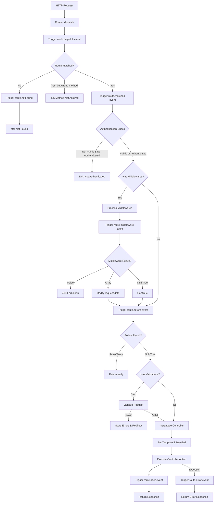
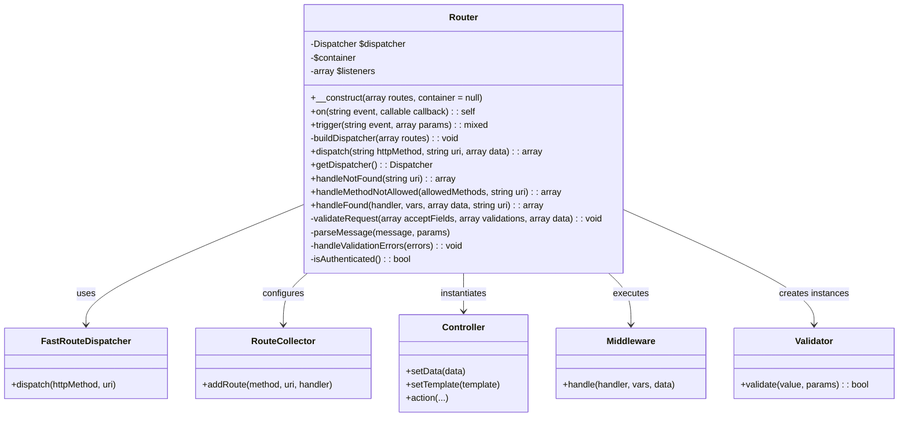
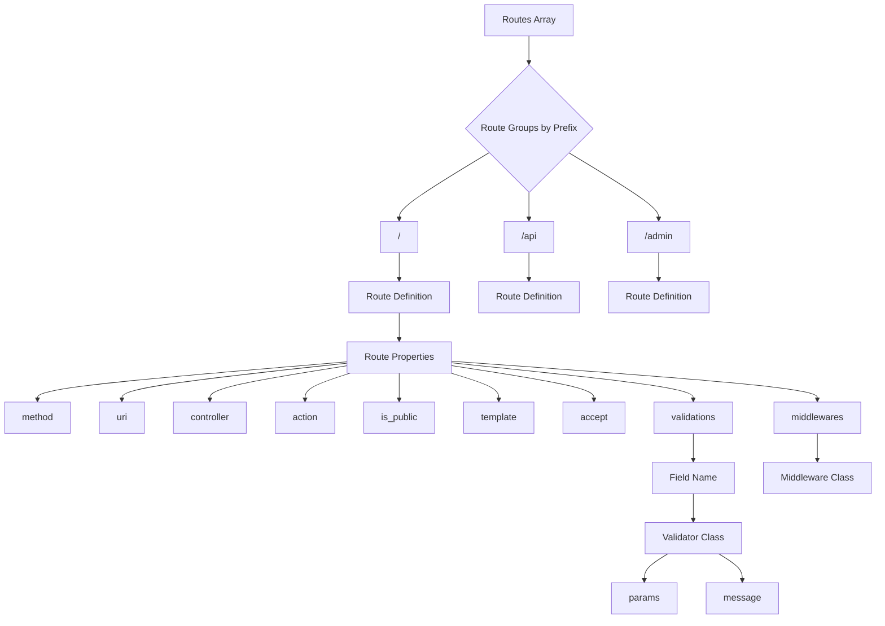
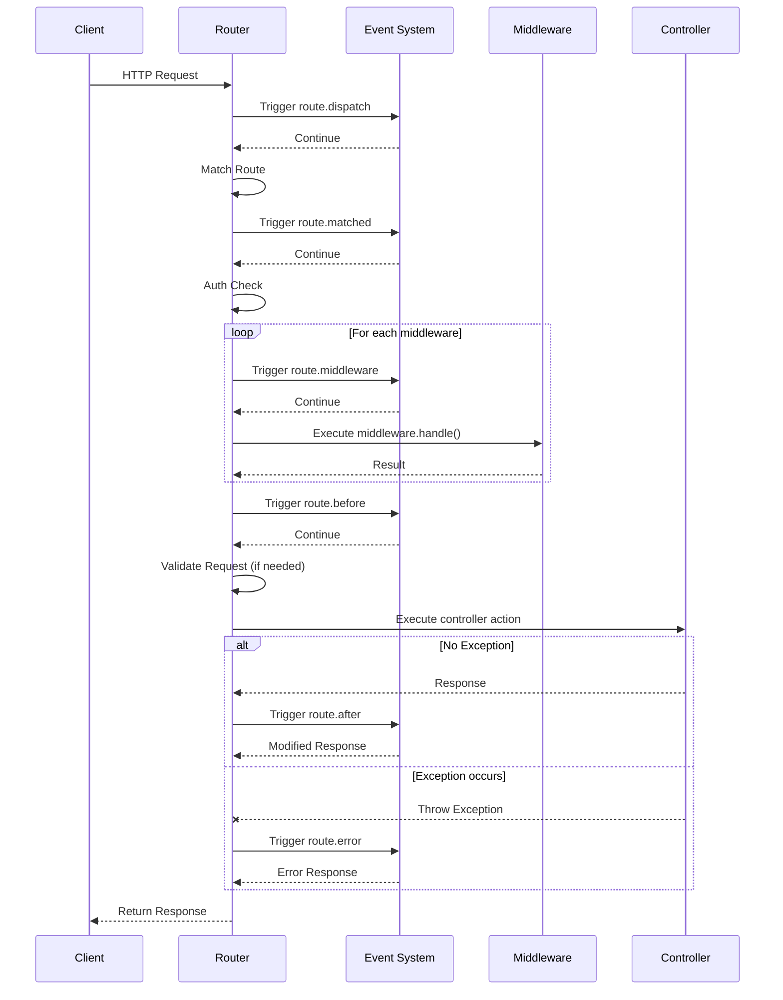

# Nexus Application Router

This document provides a comprehensive overview of the Nexus Application Router system, a PHP routing library built on top of FastRoute.

## Table of Contents

- [Overview](#overview)
- [Installation](#installation)
- [Usage](#usage)
  - [Basic Configuration](#basic-configuration)
  - [Route Definition](#route-definition)
  - [Handling Requests](#handling-requests)
- [Features](#features)
  - [Event System](#event-system)
  - [Authentication Control](#authentication-control)
  - [Request Validation](#request-validation)
  - [Middleware Support](#middleware-support)
  - [Template Support](#template-support)
- [Architecture](#architecture)
- [API Reference](#api-reference)
- [Examples](#examples)
- [Flow Diagrams](#flow-diagrams)
  - [Request Processing Flow](#request-processing-flow)
  - [Class Diagram](#class-diagram)
  - [Route Structure](#route-structure)
  - [Event System Flow](#event-system-flow)

## Overview

The Nexus Application Router is a flexible, feature-rich routing system designed for PHP applications. It provides:

- URL to controller mapping
- HTTP method routing
- Event system for hooks and extensions
- Middleware support
- Authentication checks
- Request validation
- Response handling
- Template integration

The router leverages FastRoute for efficient route matching and provides additional application-level features like authentication, validation, and template management.

## Installation

```bash
composer require nexus/application
```

## Usage

### Basic Configuration

```php
<?php
use Nexus\Application\Router;

// Define routes
$routes = [
    '/' => [
        [
            'method' => 'GET',
            'uri' => '',
            'controller' => 'App\Controllers\HomeController',
            'action' => 'index',
            'is_public' => true
        ],
        [
            'method' => 'GET',
            'uri' => 'about',
            'controller' => 'App\Controllers\PageController',
            'action' => 'about',
            'is_public' => true,
            'template' => 'about'
        ]
    ],
    '/api' => [
        [
            'method' => 'POST',
            'uri' => '/users',
            'controller' => 'App\Controllers\Api\UserController',
            'action' => 'create',
            'is_public' => false,
            'accept' => ['name', 'email', 'password'],
            'validations' => [
                'name' => [
                    'App\Validators\RequiredValidator' => [
                        'message' => 'Name is required'
                    ]
                ],
                'email' => [
                    'App\Validators\EmailValidator' => [
                        'message' => 'Invalid email format'
                    ]
                ]
            ],
            'middlewares' => [
                'App\Middlewares\RateLimitMiddleware'
            ]
        ]
    ]
];

// Initialize router
$router = new Router($routes);

// Add event listeners
$router->on('route.dispatch', function($httpMethod, $uri, $data) {
    // Log the request
    error_log("Request: $httpMethod $uri");
});

// Dispatch request
$response = $router->dispatch($_SERVER['REQUEST_METHOD'], $_SERVER['REQUEST_URI'], $_POST);
```

### Route Definition

Routes are organized in groups by prefix. Each route defines:

- `method`: HTTP method (GET, POST, PUT, DELETE, etc.)
- `uri`: The route path
- `controller`: Controller class name
- `action`: Controller method to execute
- `is_public`: Whether authentication is required (false = authentication required)
- `template` (optional): Template name for view rendering
- `accept` (optional): Fields to accept from the request data
- `validations` (optional): Validation rules for accepted fields
- `middlewares` (optional): Array of middleware classes to execute

### Handling Requests

The router processes requests by:

1. Triggering the `route.dispatch` event
2. Matching the request URI against defined routes
3. Triggering the `route.matched` event (for matched routes)
4. Checking authentication requirements
5. Running middleware stack
6. Triggering the `route.before` event
7. Validating request data if needed
8. Instantiating the appropriate controller
9. Executing the controller action
10. Triggering the `route.after` event
11. Returning the response
12. If errors occur, triggering the `route.error` event

## Features

### Event System

The router includes a powerful event system that allows you to hook into various points in the request lifecycle:

```php
// Register event listener
$router->on('route.dispatch', function($httpMethod, $uri, $data) {
    // Log the request
    error_log("Request: $httpMethod $uri");
    return null; // Continue processing
});

// Event listeners can modify the flow by returning values:
$router->on('route.before', function($handler, $vars, $data) {
    if ($handler['action'] === 'sensitiveOperation') {
        // Block the operation conditionally
        return [
            'code' => 403,
            'message' => 'This operation is currently disabled'
        ];
    }
    return null; // Continue processing
});
```

Available events:
- `route.dispatch`: Before dispatching, receives ($httpMethod, $uri, $data)
- `route.notFound`: When no route matches, receives ($uri)
- `route.matched`: When a route is matched, receives ($handler, $vars, $uri)
- `route.middleware`: Before each middleware executes, receives ($middleware, $handler, $vars, $data)
- `route.before`: Before the controller action executes, receives ($handler, $vars, $data)
- `route.after`: After the controller action executes, receives ($response, $handler, $vars)
- `route.error`: When an exception occurs, receives ($exception, $handler, $vars)

### Authentication Control

The router provides authentication control with the `is_public` flag:

- `is_public = true`: Route accessible without authentication
- `is_public = false`: Route requires authentication (checks $_SESSION['user_id'])

### Request Validation

The validation system allows defining field-specific validation rules:

```php
'validations' => [
    'email' => [
        'App\Validators\EmailValidator' => [
            'params' => [...],
            'message' => 'Invalid email format'
        ]
    ]
]
```

Validation errors are stored in `$_SESSION['validation_errors']` and the user is redirected back to the form.

### Middleware Support

The router supports middleware for pre-processing requests:

```php
'middlewares' => [
    'App\Middlewares\AuthMiddleware',
    'App\Middlewares\RateLimitMiddleware'
]
```

Middleware classes must implement a `handle` method that receives the route handler, route variables, and request data. They can:
- Return `false` to halt request processing
- Return an array to modify the request data
- Return `null` or `true` to continue processing

### Template Support

Controllers can receive template information from routes:

```php
if (method_exists($controller, 'setTemplate') && isset($handler['template'])) {
    $controller->setTemplate($handler['template']);
}
```

## Architecture

The Nexus Application Router follows a modular architecture:

1. **Initialization**: Router receives route definitions and builds a FastRoute dispatcher
2. **Event System**: Allows hooking into various points in the request lifecycle
3. **Dispatching**: Processes HTTP requests to match defined routes
4. **Middleware**: Executes middleware stack for pre-processing
5. **Handling**: Executes controllers with authentication and validation
6. **Response**: Controllers return structured responses

## API Reference

### Router Class

```php
__construct(array $routes, $container = null)
```
- Initializes the router with routes and an optional DI container

```php
on(string $event, callable $callback): self
```
- Registers an event listener for the specified event

```php
trigger(string $event, array $params = []): mixed
```
- Triggers an event and executes all registered listeners

```php
dispatch(string $httpMethod, string $uri, array $data = []): array
```
- Processes a request and returns the response
- Parameters:
  - `$httpMethod`: HTTP method (GET, POST, etc.)
  - `$uri`: Request URI
  - `$data`: Request data (typically $_POST)

```php
getDispatcher(): Dispatcher
```
- Returns the FastRoute dispatcher instance

```php
handleNotFound(string $uri = ''): array
```
- Returns a 404 Not Found response

```php
handleMethodNotAllowed($allowedMethods, string $uri = ''): array
```
- Returns a 405 Method Not Allowed response with allowed methods

```php
handleFound($handler, $vars, array $data = [], string $uri = ''): array
```
- Processes a matched route and executes the controller action

## Examples

### Basic GET route

```php
$routes = [
    '/' => [
        [
            'method' => 'GET',
            'uri' => 'products',
            'controller' => 'App\Controllers\ProductController',
            'action' => 'list',
            'is_public' => true
        ]
    ]
];
```

### Protected POST route with validation

```php
$routes = [
    '/admin' => [
        [
            'method' => 'POST',
            'uri' => '/products/create',
            'controller' => 'App\Controllers\Admin\ProductController',
            'action' => 'create',
            'is_public' => false,
            'accept' => ['name', 'price', 'description'],
            'validations' => [
                'name' => [
                    'App\Validators\RequiredValidator' => [
                        'message' => 'Product name is required'
                    ]
                ],
                'price' => [
                    'App\Validators\NumericValidator' => [
                        'message' => 'Price must be a number'
                    ],
                    'App\Validators\RangeValidator' => [
                        'params' => ['min' => 0],
                        'message' => 'Price must be at least {{min}}'
                    ]
                ]
            ]
        ]
    ]
];
```

### Using middleware and event listeners

```php
$router = new Router($routes);

// Add global authentication check
$router->on('route.matched', function($handler, $vars, $uri) {
    // Check if user has role-based permissions for this route
    if (!UserService::hasPermission($handler['controller'], $handler['action'])) {
        return [
            'code' => 403,
            'message' => 'Permission denied'
        ];
    }
    return null;
});

// Log all errors
$router->on('route.error', function($exception, $handler, $vars) {
    error_log("Error in {$handler['controller']}::{$handler['action']}: " . $exception->getMessage());
    return null;
});
```

## Flow Diagrams

### Request Processing Flow



### Class Diagram



### Route Structure



### Event System Flow

